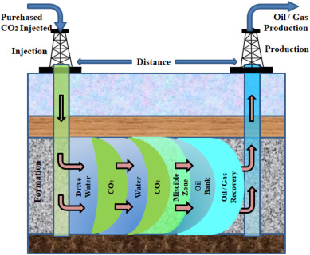

# ¿Qué métodos de recuperación secundaria se utilizan cuando la presión natural del yacimiento disminuye?  
Cuando la presión natural del yacimiento disminuye y la energía propia (expansión del gas, empuje por agua natural, etc.)
ya no es suficiente para mantener la producción, 
se aplican métodos de recuperación secundaria para restituir presión y desplazar el petróleo hacia los pozos productores.

1. Inyección de agua
Consiste en perforar pozos inyectores donde se introduce agua tratada para
mantener la presión del yacimiento y para empujar el petroleo hacia los pozos productores.
Su principal ventaja es que es de bajo costo

  

2. Inyección de gas
Se inyecta gas (natural, nitrogeno o dióxido de carbono) para aumentar la presión o mejorar el desplazamiento del crudo.

  
