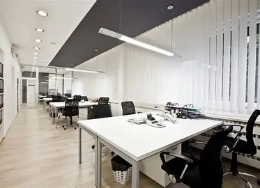

# ¿Cómo impacta el diseño del área de trabajo en el desempeño de los trabajadores?
El diseño es fundamental ya que influye directamente en como se sienten, piensan y rinden las personas.
Por ejemplo, con una iluminación natural se mejora el estado de animo y la concentración, en cambio, si hay mala iluminación,
puede haber dolores de cabeza o cansancio.
Otro ejemplo claro puede ser el exceso de rudio que afecta la concentración.

